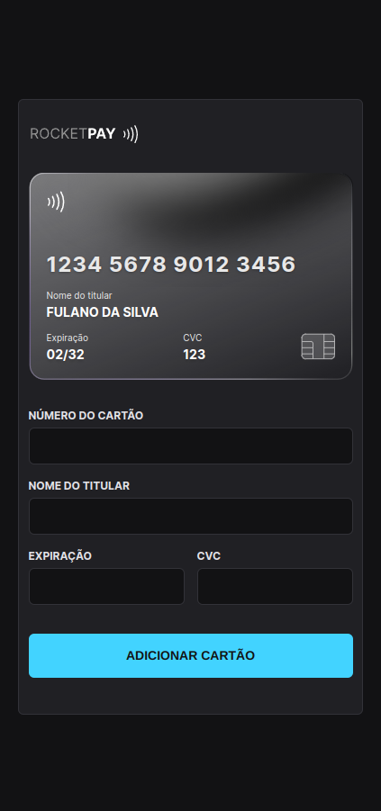

<h1 align="center"> RocketPay</h1>

	🚀 Projeto Concluído 🚀

  <a href="#-tecnologias">Tecnologias</a>&nbsp;&nbsp;&nbsp;|&nbsp;&nbsp;&nbsp;
  <a href="#-projeto">Projeto</a>&nbsp;&nbsp;&nbsp;|&nbsp;&nbsp;&nbsp;
  <a href="#-layout">Layout</a>&nbsp;&nbsp;&nbsp;|&nbsp;&nbsp;&nbsp;
  <a href="#memo-licença">Licença</a>

  

  &nbsp;&nbsp;
  &nbsp;&nbsp;
  

 

<h2>
   💻 desktop
</h2>&nbsp;

  

<h2>
   📱 Mobile
</h2>&nbsp;

  

&nbsp;

<h2>
  🎥 Vídeo da aplicação
</h2>

## 🚀 Tecnologias

Esse projeto foi desenvolvido com as seguintes tecnologias:

- HTML e CSS
- JavaScript e JSON
- [Node e NPM](https://nodejs.org/)
- [Vite](https://vitejs.dev/)
- [iMask](https://imask.js.org)

## 💻 Projeto

O Rocketpay é um componente que simula o formulário de preenchimento de cartão de crédito, onde é possível adicionar máscara aos inputs e atualizar elementos HTML via DOM.

## 🔖 Layout

Você pode visualizar o layout do projeto através [DESSE LINK](https://www.figma.com/file/gpqavL469k0pPUGOmAQEM9/Explorer-Lab-%2301/duplicate). É necessário ter conta no [Figma](https://figma.com) para acessá-lo.

## 👨‍💻 Autor

<a href="https://www.linkedin.com/in/daniel-guimaraes-vieira/">
 
  
 <b>Daniel Guimarães</b></a> <a href="https://www.linkedin.com/in/daniel-guimaraes-vieira/" title="Rocketseat">🚀</a>
  

## 📝 Licença

Este projeto esta sobe a licença [MIT](./LICENSE).

Feito com ❤️ por Daniel Guimarães 👋🏽 [Entre em contato!](https://www.linkedin.com/in/daniel-guimaraes-vieira/)
